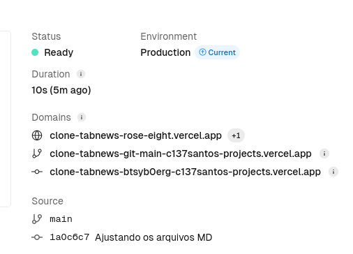
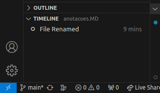
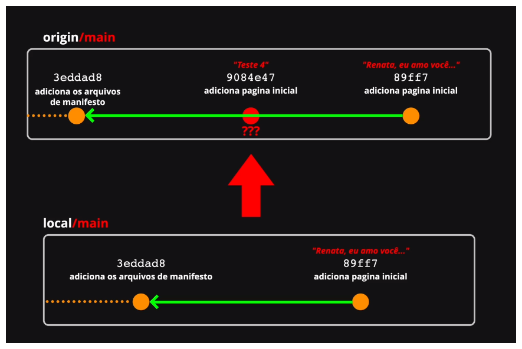

<head>
  <link rel="stylesheet" type="text/css" href="style.css">
</head>

# Estudos do meio do caminho

### Túneis de desenvolvimento

Como estava desenvolvendo no VScode, então utilizei os [túneis de desenvolvimento da própria Microsoft](https://learn.microsoft.com/pt-br/azure/developer/dev-tunnels/overview) para gluns testes!

### Deploy no Vercel

O deploy fiz pelo vercel [URL](https://clone-tabnews-3pf2.vercel.app/).
A versel é a criadora do Next.js, por isso essa escolha. A Versel está super integrada ao framework desse projeto.

"Os túneis de desenvolvimento permitem que os desenvolvedores compartilhem com segurança serviços Web locais na Internet".

A cada novo push vai gerar um deploy na URL oficial, e além disso, mais dois links permanentes de cada um dos push que for feito.

<div class="imagem-container">
  
</div>

Em caso de problemas com deploy com a URL oficial, pode ser usado as URLs de deploy anteriores para reestabelecer rapidamente o site.

### Next

Renderizar a página do lado do cliente pode levar uma série de consequências ruim para experiência do usuário (lentidão no carregamento do conteúdo) e danos ao SEO.

Solução? renderizar do lado do servidor aplicando uma pré-renderização estática.

O Next.js é um framework para o React para executar a pré-renderização de forma simples.

Para instalar o Next.js, você precisa ter o Node.js instalado para usar do comando [npm](https://www.freecodecamp.org/portuguese/news/o-manual-do-next-js-para-iniciantes/)

1- package.json é um manifesto que guarda metadados do projeto, como autor e descrição. Alguns scripts, como npm run! mas principalmente guarda as dependências instaladas com 'npm install', como o react ou next!

2 - package-lock.json toma conta exclusivamente com as dependências e suas versões, e as dependências das suas dependências.

### git-introducao

#### VSCode

O VSCode tem uma timeline que valida cada alteração do seu código e você pode visitar como um versionamento.

<div class="imagem-container">
  
</div>

#### Lista de comandos abordados

- git log - listar os commits do repositório.
- git add - sobe alterações para a staging area.
- git commit - realiza novos commits.
- git commit --amend - subsitui o commit anterior por um novo, mas aproveita as alterações dele.
- git diff - calcula a diferença entre as versões/alterações dos arquivos.

**Commit** significa compromisso, você se responsabiliza com essas alterações. O commit tem um hash que é um identificador único.

**3 estágios**

1º Modified - todos arquivos modificados.

2º Staged - Qual desses arquivos vai ser commitado.

3º Commit - É registrado a modificação.

#### git commit --amend

Como remendar um erro localmente?

Se o commit estiver errado, você pode usar o --amend.

```
git commit --amend
```

ammend se aplica exatamente e unicamente ao último commit, o que está mais na ponta final do histórico de commits.

Com git commit --amend --no-edit, essa flag --no-edit vai fazer com que você faça o "amend", mas sem precisar mudar mensagem de commit nem nada.

```
# Edit hello.py and main.py
git add hello.py
git commit
# Realize you forgot to add the changes from main.py
git add main.py
git commit --amend --no-edit
```

Os comando push e push com force serão utilizado para jogar nossos commits em origin.

```
git push --force
# Empurrar de forma forçada alterações locais para o origin.
git push -f
# Forma comprimida do comando anterior.
```

Mas por quê preciso fazer um commit forçado? Porque você pertubou a linha do tempo.

<div class="imagem-container">
  
</div>

Ao utilizar o ammend, é criado outro commit que subtituirá o ammendado! Não há sobrescrição de commits, pois eles são imutáveis, portanto, possuem hashs únicos.
Então commit (A) que existe tanto local quanto no remoto, que foi ammendado, foi, na verdade, descartado, e substituiu pelo ammend, commit (B).
Apesar de você ter descartado o último commit (A) do seu repositório local e existe outro (B), o commit (A) ainda existe no reposositório remoto.

Essa foi a pertubação da linha do tempo entre o que está o local e que está no origin. Quebrando a ordem e a dependência sequencial.

<div class="imagem-container">
  
</div>

### Organização de Tarefas

Quando se planeja muito, em excesso, normalmente, se executa pouco. Quando se planeja pouco, se executa muito, mas com efeitos colaterais como arquitetura ou modelagem ruim.
É preciso calcular o saldo das coisas que são feitas para determinar se vale a pena ou não continuar dessa forma.

**1º Ser lembrado individualmente**

- Diversas vezes me perdi no que estava fazendo, pois via outras peças do tetris que poderiam ser encaixada. O TDAH é um título de pós-graduação nisso.
- Menor custo de produção
  **Solução**: Grudar post-it no monitor com o objetivo ou fazer uma lista simples ao lado

**2º Ser lembrado coletivamente**

- A equipe deve estar alinhado em um objetivo
  **Solução**: Quadro kanbam.

**3º Expandir conhecimento**

- Conversar e desenvolver de uma forma detalhada o que e como algo deve ser feito.
- Médio custo de produção e médio tempo de aquecimento.
  **Solução**: Reuniões de alinhamento

**4º Com Métricas**

- Conseguir mensurar a produtividade
- Alto custo de produção e alto tempo de aquecimento
- Mais cansativo do que a própria tarefa, mas é essencial para a gestão do projeto
  **Solução**: Geração simples em um excel

|             | Semana 1 | Semana 2 | Semana 3 |
| ----------- | -------- | -------- | -------- |
| Tarefas     | 10       | 15       | 22       |
| Concluídas  | 5        | 7        | ?        |
| % Conclusão | 50%      | 46.6%    | ?        |

#### Use milestones

Os grandes objetivos, como objetivos da sprints!
Por exemplo: 1º conectar com banco, 2º iniciar o framework, 3º dockerizar o projeto, 4º desenvolver a home, 5º adicionar features de comentários, 6º adicionar usuários e validações.

### Organizador de código

Não deixe a base de código crescer com sua letra, você precisa de um formatador de código, como um black ou ruff para o Python.

Para Next e Javascript

#### EditorConfig

Com o [editorconfig](https://editorconfig.org/) Podemos criar um arquivo de configuração que vai deixar tudo arrumadinho, independete do gosto do editor que usar. As configurações normais do editor vão ser trocadas pelo primeiro arquivo encontrado na árvore de diretório. Não encontrado nenhum, ai aplica as regras do editor.
Devemos utilizar a extensão do `editorconfig for vs code` para que o vs consiga compreender e aplicar as config do arquivo [.editorconfig](#editorconfig)
Mas ele não conserta código existentes de forma simples. Por isso, melhor partir para o prettier!

#### Prettier

Ele é um formatador de código opinado, mas também lhe permite novas regras.
Não é uma boa forma instalar extensão do vscode, pois isso não é escalável. Melhor trazer para as configurações do projeto por meio do npm, com o comando:

```sh
npm install prettier -D
```

Agora o manifesto de package.json contém prettier está na lista de dependência de desenvolvimento (devDependencies).

Após escrever os scripts é necessário rodar o 'npm run' para salvar.

**lint:check modo de conferência**
Entre os Scripts foi adicionado o "lint:check", onde check é o modo de conferência, e o ponto indica que a varredura deve ser de todos os diretórios a partir daquele.

**lint:fix**
Entre os Scripts foi adicionado o scrip "lint:fix", onde o comando é --write permite escrever no projeto consertando conforme as regras postas para o prettier.
